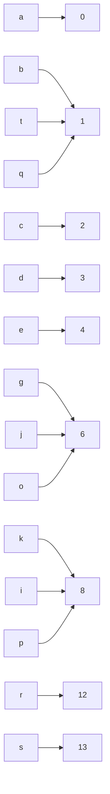

# Context Cipher: Concept Note

*A summary of the idea, its motivation, and proof-of-concept results.*

---

## Motivation

Modern encryption standards—such as **AES**, **RSA**, and others—reliably perform mathematical operations on the numeric representations of alphabetic characters. The most widely used mapping system, **ASCII** (American Standard Code for Information Interchange), facilitates seamless global data exchange with clarity and efficiency. However, ASCII was designed for standardization, **not** cryptography.  
If the core objective of encryption is to render plain information unrecognizable, why rely on a mapping system intended for the opposite purpose?

### Key Limitations of Conventional Mapping

- **Fixed one-to-one character-to-code correspondence** (e.g., `a = 97`, `b = 98`, `c = 99`)—this simplicity enables frequency-analysis attacks.  
- **Predictable ciphertext structure**—common di-grams and tri-grams persist, leaving patterns exploitable by statistical methods.

This project explores an alternative approach: **distorting the foundational mapping layer *before* applying standard encryption**.  
By leveraging **deep-learning sequence models**, we automate reconstruction of the original message, enhancing security through obfuscation before encryption.

---

## The Core Idea

Instead of encrypting ASCII codes directly, we first apply a **non-linear mapping** from letters to integers. After converting from characters to numeric codes, we feed the data into conventional ciphers (AES, RSA, Caesar, etc.).  
The result is ciphertext that—even before encryption—bears no statistical resemblance to typical English text.

### Custom Letter-to-Index Mapping

```python
letter_to_index_custom = {
    'a': 0,  'b': 1,  'c': 2,  'd': 3,  'e': 4,
    'f': 5,  'g': 6,  'h': 7,  'i': 8,  'j': 6,
    'k': 8,  'l': 9,  'm': 10, 'n': 11, 'o': 6,
    'p': 8,  'q': 1,  'r': 12, 's': 13, 't': 1,
    'u': 14, 'v': 4,  'w': 15, 'x': 0,  'y': 0,
    'z': 4
}
```

#### Visualizing the Mapping



*Figure 1 – A simplified subset of our non-linear letter-to-index graph.*

---

## Proof-of-Concept Results

We trained a lightweight GRU-based sequence model on text scrambled using our custom mapping and random positional jitter. The model’s task was to reconstruct the original text from its distorted representation. For instance, the word **“reheat”** is first transformed into a scrambled sequence like `r[ezv]h[ezv][axy][tqb]`, where brackets denote injected noise. Despite this obfuscation, the model successfully predicts the most probable original sequence, **“reheat”**, by learning contextual relationships between characters.

### Key Metrics

| Metric                                 | Value                               |
| -------------------------------------- | ----------------------------------- |
| Decoder architecture                   | GRU                                 |
| Training corpus                        | 50k sentences (Project Gutenberg)  |
| Scramble scheme                        | Custom map + random position jitter |
| **Validation reconstruction accuracy** | **99%**                            |

Additional examples demonstrate the model’s robustness:  
1. **Scrambled input**: `avsqxrdxx` → **Decoded output**: “yesterday”  
2. **Scrambled input**: `r[ezv]h[ezv][axy][tqb]` → **Decoded output**: “reheat”  

---

## Implications

1. **Mapping as a Cryptographic Key**  
   The non-linear letter-to-index map acts as a secret key. Without knowledge of this mapping, decryption becomes computationally infeasible. Regularly rotating or regenerating the map provides a straightforward mechanism for key refreshment, enhancing security without altering encryption algorithms.

2. **Layered Security Framework**  
   - **Pre-encryption distortion**: Removes linguistic patterns, rendering frequency and n-gram analysis ineffective.  
   - **Standard encryption layer**: Processes already randomized data, compounding security.  
   - **Adversarial requirements**: Attackers must compromise both the mapping scheme and the encryption algorithm to recover plaintext.

---

## Conclusion

This technique is **not** a standalone encryption algorithm. Instead, it introduces a *strictly non-linear symbol-to-numeric mapping* as a secret key, with a trained neural network model serving solely to decode obfuscated plaintext. By integrating AI-driven reconstruction, the method adds a robust defense-in-depth layer when combined with established ciphers like AES or RSA—all while remaining compatible with existing encryption protocols.  

The approach addresses a critical gap in traditional systems: the inherent predictability of standardized mappings. Future work will explore dynamic mapping generation and integration with post-quantum cryptographic schemes.
