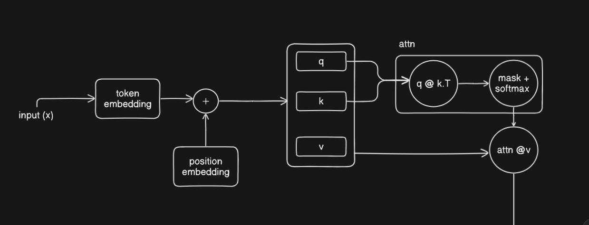
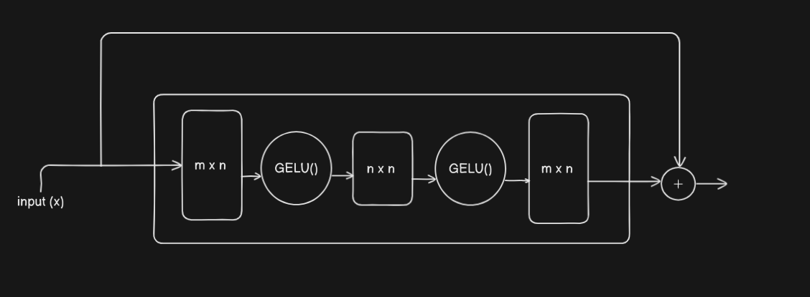

# Autoencoder Attention Mechanism

## Overview

This simple research project implements attention mechanisms in transformers, by replacing the Q, K, V linear projections with **autoencoders** to represent attention scores.

## Key Idea

In a standard transformer attention block (shown below), the input goes through token and position embeddings, then gets transformed into Q, K, and V matrices through simple linear projections:

But what if we made those Q, K, V transformations more expressive? Instead of basic linear projections, we use autoencoders - neural networks that compress and reconstruct the input through a bottleneck:

So each of Q, K, and V now gets its own autoencoder. The idea is that by forcing the information through a smaller bottleneck with non-linear activations, we might learn richer representations for attention.