# Autoencoder Attention: A Fun Experiment with Transformers

## What's This About?

This project explores a simple modification to the standard Transformer architecture. Instead of using regular linear projections for the attention mechanism, I experimented with replacing them with autoencoders to see what would happen!

## The Idea

Standard Transformers are amazing at processing sequences, but I wondered: what if we added a compression step that forces the model to focus on the most important patterns? Kind of like how we naturally filter information when we're in a noisy room - we don't process everything, just what matters.

## What I Changed

In a regular Transformer, the attention mechanism uses simple linear layers:

```mermaid
graph LR
    A[Input x] --> K["k = Linear(x)"]
    A --> Q["q = Linear(x)"]
    A --> V["v = Linear(x)"]
    
    Q --> QK["q·k"]
    K --> QK
    
    QK --> SM[Softmax]
    SM --> ATT[×]
    V --> ATT
    
    ATT --> OUT[Output]
```



My experiment swaps these out for autoencoders:


Each autoencoder has an encoder, a bottleneck (smaller dimension), and a decoder. This creates a natural information filter:


## The Experiment

I tested this on character-level text generation. A key finding: **less is more!**

- **Model size**: Started with 460K parameters
- **Why smaller?**: Too many autoencoders can actually hurt performance - they add complexity without benefit
- **The sweet spot**: Using autoencoders to focus attention while keeping the model small prevents overfitting
- **Task**: Generate text character by character
- **Dataset**: BookCorpus

## Results

The 460K parameter model learned to generate coherent text! Here's the progression:

**Start (Epoch 0)**: Random gibberish
```
)o n zcsz   t  q  i ha a8amis/ sa siin f1ro wdoe...
```

**Middle (Epoch 1000)**: Starting to form words
```
sound 1 even leann just still remainly's manage exped...
```

**End (Epoch 9999)**: Coherent (if quirky) sentences
```
to sheep the large ring apoan torce you about and make our running jokening...
```

Final validation loss: **1.4141** - showing that the focused, smaller model can learn effectively!

## What I Learned

1. **It works!** The autoencoder modification didn't break the Transformer - it still learns to generate text.

2. **Size matters (but not how you'd think)**: The 460K parameter model performed well - adding more autoencoders doesn't automatically improve things and can lead to overfitting.

3. **Sparse attention patterns**: The model seems to focus on fewer connections, possibly because the autoencoder forces it to be selective.

4. **Efficiency through constraints**: By forcing the model to compress information, we get a smaller, more focused model that still performs reasonably well.

## Why This Might Be Interesting

The autoencoder bottleneck acts like a filter, potentially helping the model focus on important patterns while ignoring noise. It's similar to how compression algorithms work - they keep the important stuff and discard redundancy.

## Limitations & Future Work

- This was tested only on small-scale character-level modeling
- More rigorous comparisons with standard Transformers needed
- Would be interesting to test on larger tasks and datasets
- The computational overhead of autoencoders might offset any efficiency gains

## Technical Details

Built with PyTorch, using:
- GELU activation functions
- LayerNorm for stability
- Character-level tokenization
- Standard cross-entropy loss for language modeling

## Try It Yourself!

Feel free to experiment with this idea! The core change is simple - just replace linear projections with autoencoders in the attention mechanism.

## Acknowledgments

This project builds directly on the Transformer architecture from "Attention Is All You Need" (Vaswani et al., 2017). All credit for the foundational architecture goes to the original authors. This is just a fun experiment exploring a small modification!

---

**Created by**: Okereke Chukwudi Donald  
3rd Year Computer Science Student @ University of Windsor

📧 [okereke1@uwindsor.ca](mailto:okereke1@uwindsor.ca)  
💼 [LinkedIn](https://www.linkedin.com/in/chukwudi-okereke-46823a241/)  
🐙 [GitHub](https://github.com/ChukwudiDonald)

---

*Note: This is an experimental project done for learning and exploration. Results should be taken as preliminary findings from a student project, not as rigorous research claims.*