```mermaid
graph LR
    A[Input x] --> K["k = Linear(x)"]
    A --> Q["q = Linear(x)"]
    A --> V["v = Linear(x)"]
    
    Q --> QK["q·k"]
    K --> QK
    
    QK --> SM[Softmax]
    SM --> ATT[×]
    V --> ATT
    
    ATT --> OUT[Output]
```

# Autoencoder Attention for Transformers

## Introduction

When I started looking at how standard Transformers work, something struck me as peculiar about their approach to learning. They attempt to model every possible interaction between tokens in a sequence, regardless of whether those interactions are meaningful or just noise. It's like trying to memorize every detail of a conversation when you really just need to understand the main points.

This observation aligns with what cognitive scientists have long known about human memory. As psychologist William James noted in his principles of psychology, we don't store every detail we encounter - instead, we naturally filter and compress information, keeping only what's meaningful or unique to us. The "cocktail party effect" is a perfect example: in a crowded room, we automatically filter out most conversations to focus on the one that matters to us.

This got me thinking: what if we could design a Transformer that naturally focuses on what matters most, similar to how our own minds work?

## The Problem with Standard Transformers

Standard Transformers use simple linear projections to create queries (Q), keys (K), and values (V) for their attention mechanism. While this works well, it has some inefficiencies:



The model doesn't know which patterns are important ahead of time, so it tries to learn everything. This means:
- Computational resources are wasted on irrelevant patterns
- The model might overfit to noise in the training data
- More parameters are needed to capture the same amount of useful information

## My Approach: Autoencoder Attention

I decided to replace the simple linear projections with autoencoders. This creates a natural information bottleneck:


The key insight is that autoencoders must learn to compress and reconstruct information. They can't afford to waste their limited capacity on noise or redundant patterns - they naturally learn to focus on what's most important for reconstruction.

## Why This Works

Think about how compression works in everyday life. When you summarize a long article, you don't include every detail - you extract the core ideas that allow someone to understand the main points. The autoencoder approach does something similar for attention mechanisms.

### The Information Bottleneck Effect


The bottleneck forces the model to make choices. It can't encode everything, so it must learn which patterns are truly essential for understanding the relationships between tokens.

### Hierarchical Learning

Another interesting property I observed from this approach: as you stack multiple layers of autoencoder transformers, each layer tends to learn increasingly abstract patterns:

1. **Early layers**: Basic syntactic patterns (word order, simple dependencies)
2. **Middle layers**: Semantic relationships (meaning, context)
3. **Later layers**: High-level concepts (intent, reasoning)

This happens naturally because each layer's autoencoder must find the most efficient way to represent the information from the previous layer.

## Practical Benefits

I've observed several advantages in my experiments:

### 1. Efficiency
The model achieves similar performance with fewer parameters. By focusing on essential patterns, we don't need as much capacity to store redundant information.

### 2. Interpretability
The compressed representations are often more interpretable. When I look at what the autoencoder learns to preserve, it usually corresponds to linguistically meaningful patterns.

### 3. Generalization
Models trained with autoencoder attention tend to generalize better to new types of text. This makes sense - core patterns are more likely to transfer across domains than specific details.

## Implementation Details

The architecture modification is straightforward. For each attention head, instead of:

```python
Q = Linear(input)
K = Linear(input)
V = Linear(input)
```

I use:

```python
Q = AutoEncoder(input)  # Encode → Bottleneck → Decode
K = AutoEncoder(input)  # Encode → Bottleneck → Decode
V = AutoEncoder(input)  # Encode → Bottleneck → Decode
```

Each autoencoder consists of:
- An encoder that compresses the input
- A bottleneck layer (reduced dimensions)
- A decoder that reconstructs the output
- GELU activation and LayerNorm for stability

## Results and Observations

My experiments with character-level language modeling show promising results. The progression from random characters to coherent text happens similarly to standard Transformers, but with some interesting differences:

- The model learns basic patterns (word boundaries, common letter combinations) more quickly
- The attention patterns are sparser and more focused
- Performance plateaus are reached with fewer parameters

- **Best Model**: `result3.txt` (2.6M params) reached val_loss=1.3182.  
- Samples show coherent text generation by epoch 1000.  
- Full logs: [results1.txt](./result1.txt), [results2.txt](./result2.txt), [results3.txt](./result3.txt).  

## Conclusion

By introducing autoencoders into the attention mechanism, I'm essentially asking the model to figure out what's worth paying attention to before it starts attending. It's a simple change that aligns with how we naturally process information.

This approach mirrors what neuroscientist Daniel Kahneman describes in "Thinking, Fast and Slow" - our brains don't process every piece of information equally. We have built-in mechanisms for filtering and compressing information, keeping only what's salient or surprising. The autoencoder bottleneck serves a similar function, forcing the model to identify and preserve only the most important patterns.

The beauty of this approach is that I'm not manually deciding what patterns are important. The autoencoder discovers this through the natural pressure of having to compress and reconstruct information. In a sense, we're letting the model learn how to learn more efficiently - much like how human memory naturally evolved to be selective rather than exhaustive.


Created by **Okereke Chukwudi Donald** - 3rd Year CS Student @ University of Windsor
- 📧 [okereke1@uwindsor.ca](mailto:okereke1@uwindsor.ca)
- 💼 [LinkedIn](https://www.linkedin.com/in/chukwudi-okereke-46823a241/)
- 🐙 [GitHub](https://github.com/ChukwudiDonald)

