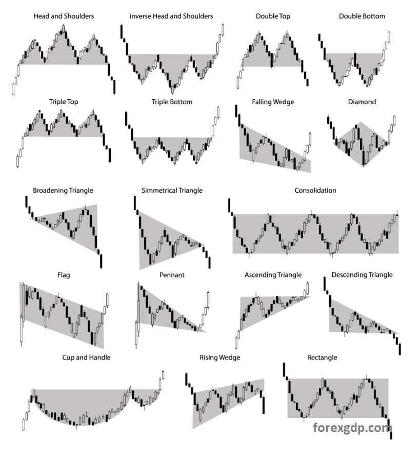
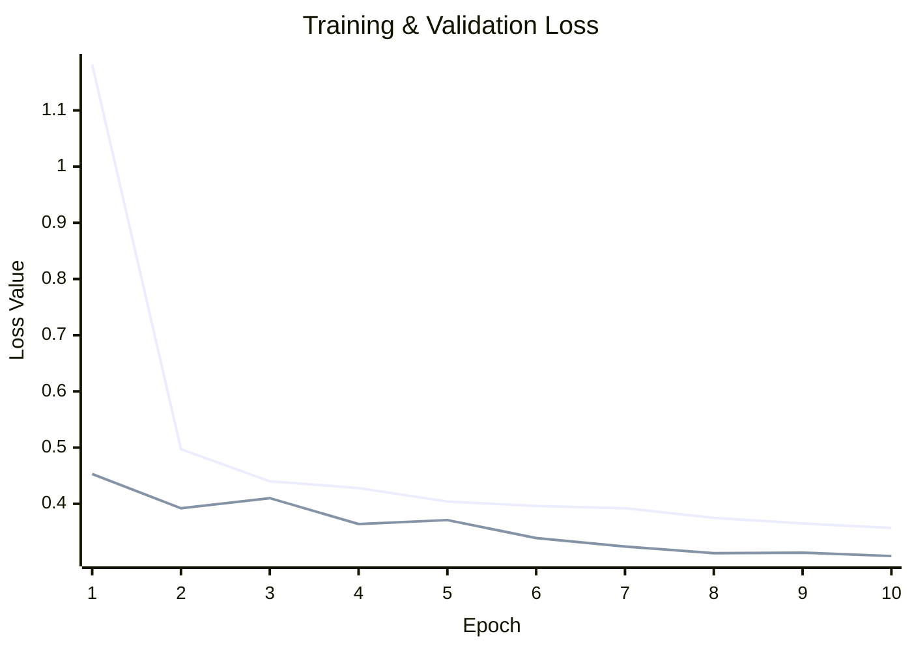
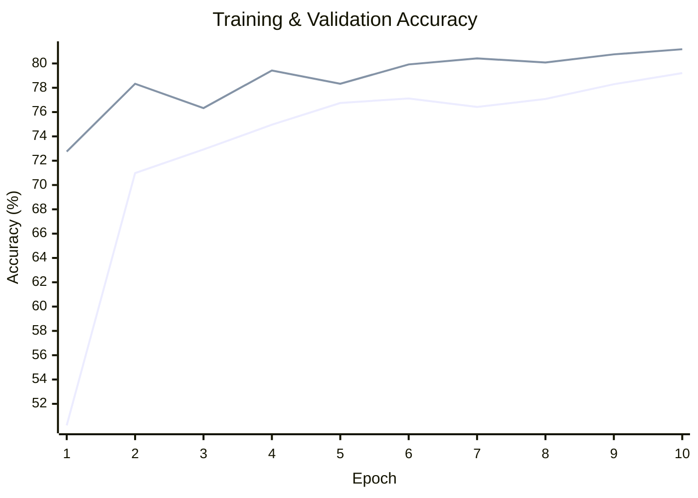

# Classifying Financial Market Structures with CNNs:
**Credit**: This project builds on the methodology from *"Encoding Candlesticks as Images for Pattern Classification Using Convolutional Neural Networks"* by **Jun-Hao Chen and Yun-Cheng Tsai**, who pioneered the use of Gramian Angular Fields (GAF) for financial market pattern recognition.

---

### **Introduction**
Financial markets form structures through price movements, trends, reversals, and consolidations, that traders analyze to identify opportunities. While traditional machine learning models try to predict raw prices, practitioners often focus on *patterns* (e.g., head-and-shoulders, double tops) to time entries and exits. Examples of such pattens can be seen in the image below.

*Image source: [forexgdp.com](https://www.forexgdp.com/learn/chart-patterns/)*

Chen and Tsai’s key insight was treating these patterns as *visual features*. Since financial data is 1D (time-series) but Convolutional Neural Networks (CNNs) excel with 2D images, they proposed encoding price data as Gramian Angular Fields (GAF). This preserves temporal relationships while enabling CNNs to "see" patterns like a human would.

---

### **Methodology**
1. **Data Preparation**:
    - **Synthetic Data Generation**: To test the paper’s approach, I generated synthetic candlestick patterns (e.g., uptrends, double bottoms) mimicking real market behavior.
    - **Feature Engineering**: Instead of raw OHLC (Open/High/Low/Close), the model uses **CULR** (Close, Upper/Lower shadows, Real-body), which the authors showed improves accuracy.

2. **GAF Encoding**:
    - Converts 1D price series into 2D images by:
        1. Normalizing prices to polar coordinates.
        2. Computing cosine similarities between time points to create a Gramian matrix.
    - Preserves temporal dependencies as spatial relationships in the image.

3. **CNN Architecture**:
    - Adapted from LeNet (as in the paper), with convolutional layers to extract local patterns and dense layers for classification.
    - Trained on labeled GAF images of market structures.

---

### **Results**
The model demonstrated strong and stable learning, culminating in a **final validation accuracy of 81.17%** over 10 epochs. Visualizing the training progress reveals a classic, healthy learning curve. The charts below, clearly visualize the model's convergence and robust performance.

---

### **Key Takeaways**
1. The GAF-CNN method successfully bridges the gap between quantitative analysis and trader intuition by treating patterns as visual features.
2. Synthetic data validated the paper’s claims, with CULR features proving effective for pattern recognition.
3. Future work could expand the pattern set or incorporate real-market noise for robustness.

**Acknowledgments**: Again, full credit to Chen and Tsai for their foundational work. This project demonstrates the practicality of their approach.